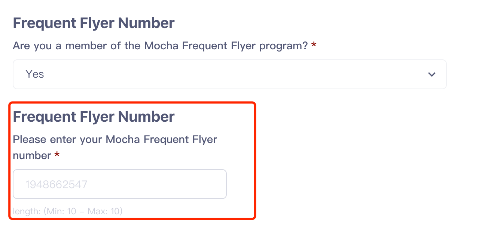
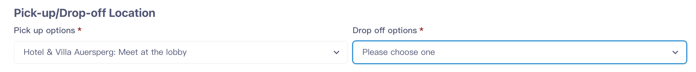
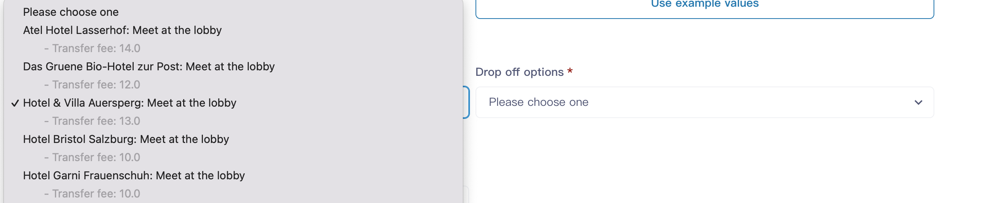
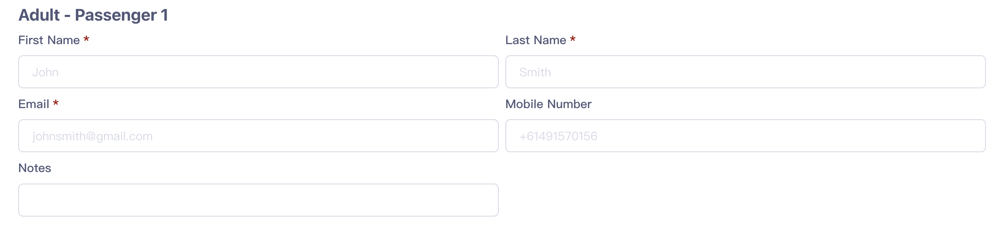

# Tips for Front-end Developpers about Using the Flow data

## 0. Introduction

This specification focuses only on suggestions for front-end developers to display questions/fare selections/add-ons and validate answers to them. To understand this, a general understanding about how the checkout flow works is required. The following files describe the whole checkout flow.

- [Livn API v2.0 Developer Guide](https://dev.livnapi.com/public/Livn_API_v2.0_Developer_Guide.pdf)

- [brief introduction of Checkout flow ](https://drive.google.com/file/d/1IbJ6DqkAS_Udhj-SWcWjfTgwEVc30dea/view?usp=sharinghttps://drive.google.com/file/d/1IbJ6DqkAS_Udhj-SWcWjfTgwEVc30dea/view?usp=sharing)

## 1. Display the questions using the data from flow

There are no fixed questions, or number/format of questions, different product can have very diffrent questions. However, every question is organized with structured information that can be used to construct the question in the front-end.

For example, the following data of question ,

```json
{
  "questions": {
    "questionGroups": [
      {
        "caption": "Passenger Count",
        "questions": [
          {
            "uuid": "00000002-0001-0012-0001-000000000000",
            "scope": "PER_GROUP",
            "answerType": "INTEGER",
            "title": "From the available fares for this date, the passenger count should be a minimum of 1 and a maximum of 10",
            "example": "1",
            "required": true,
            "mustShow": true
          }
        ]
      }
    ]
  }
}
```

can be used to construct web elements like the following.


### 1.1 Get Question Data.

#### 1.1.1 Timing of getting question data

Questions can be included in the reponse of  any step from calling the API of

      **POST**   ***/api/flow***
before the flow come to the milestone of COMFIRMED BOOKING. They can appear at the milestone of FARE SELECTION, meaning that questions and fareSelections can be returned in the same response by Livn API.

#### 1.1.2 The structure of question data

Serval question goups can be raised at the same step, and serval questions can be included in the same group. So a single question is always embeded in in a structure like the following.

The **caption** for questionGroups are essential element to build the controls to display the quesitons.

```json
{
   "questions":{
       "questionGroups": [
            {
              "caption":"",
              "questions":[
                 ...
                ]
            }
        ]
    }
}
```

Let us focus on the structure of a single question.

```json
{
    "uuid":"",
    "fareUuids":["Fare.uuid or AddOn.uuid" ],
    "scope":"PER_GROUP/PER_UNIT/PER_FARE",
    "answerType":"",
    "purpose":"",
    "title":"",
    "description":"",
    "feeDescription":"",
    "example":"",
    "selectOptions":[
         {   
            "description":"",
            "uuid":"",
            "title":"",
            "description":"",
            "feeDescription":"",
            "followUpQuestions":questionGroups
         }    
    ]
    "selectMin":integer,
    "selectMax":integer,
    "valueMin":"",
    "valueMax":"",
    "lengthMin":integer,
    "lengthMax":integer,
    "multiLine":boolean,
    "regex":"",
    "defaultValue":"",
    "required": boolean,
    "mustShow": boolean

}
```

### 1.2 Display the quesitons

Besides of fare selection made by the customer in **FARE_SELECTION** milestone, customer's answers for questions can also affect the final quote. So to avoid misunderstanding or fee disputes, all questions have to be displayed properly.

To display the questions, the information for question groups shoud be first displayed to general description about the questions to be asked. The value of **caption** for question group should be used here.

To display a single quesiton, it is important to keep in mind the following.

- **Describe the question and selectOption**
  Usually the value of property ***title*** describes the question well, but if the values of properties ***description*** and ***feeDescription*** are not empty or null, they should be displayed to the user. Especially the value of ***feeDescription***, it usually serves as a reminder to the user that how the answer of current question can affect the final quote.
  
  The above properties for questions also apply to selectOptions desciptions, ***title, description, feeDescription***.

- **Data type of the answer expected**
  
  The value of the ***answerType*** property indicate what kind of data type is expected for the answer to current question. So it also defines how we display the input control for the answer to the current question and also how we validate the answer.
  
  Possible values for this property include  ***BOOLEAN, INTEGER, DECIMAL, TEXT, BINARY, DATE, TIME, SELECT_SINGLE, SELECT_MULTIPLE, EMAIL, PHONE***. 11 in total for now
  
  For example,
  
  - a BOOLEAN answer can be displayed with a checkbox
  
  - a BINARY answer can be displayed with a file selector
  
  - a INTEGER,DECIMAL,TEXT,EMAIL or PHONE can be displayed with a input box or line
  
  - a SELECT_SINGLE or  SELECT_MULTIPLE answer can be displayed with a group of check box or a dropdown list box
  
  - a DATE or TIME answer can be displayed with datetime picker.
  
  The style and format of the controls can be designed by the designer, but kind of ***answerType*** should be considered.

- **Placeholder for the answer**
  To give an example of the answer to the user, we can set a placeholder at the answer control. The vaule of property ***example*** or ***defaultValue***（if presented）  can be used to do this.

- **Autofill**
  The purpose for some questions are collecting one specific type of information for the consumer, for example phone numer or gender. This type of questions are marked by the ***purpose***  property. If the user save consumer information before booking a product we can use this property to automatically answer this type of questions.
  
  The value of the ***purpose*** are extendable, for now possible values include PAX_TITLE, PAX_FIRST_NAME, PAX_MIDDLE_NAME, PAX_LAST_NAME, PAX_FULL_NAME, PAX_GENDER, PAX_EMAIL, PAX_PHONE, PAX_MOBILE, PAX_NATIONALITY, PAX_FULL_ADDRESS, PAX_ADDRESS_LINE_1, PAX_ADDRESS_LINE_2, PAX_STREET_NAME, PAX_STREET_NUMBER, PAX_CITY, PAX_POSTCODE, PAX_STATE, PAX_COUNTRY, PAX_LANGUAGE, PAX_AGE, PAX_DOB, PAX_PLACE_OF_BIRTH, PAX_COUNTRY_OF_BIRTH, PASSPORT_NUMBER, PASSPORT_EXPIRY_DATE, PASSPORT_ISSUED_DATE, PASSPORT_ISSUING_AUTHORITY, PICK_UP, DROP_OFF, FLIGHT_NUMBER_INBOUND, FLIGHT_NUMBER_OUTBOUND, SUPPLIER_NOTES, LOYALTY_PROGRAM_NUMBER, EMERGENCY_CONTACT_RELATION, EMERGENCY_CONTACT_TITLE, EMERGENCY_CONTACT_FIRST_NAME, EMERGENCY_CONTACT_MIDDLE_NAME, EMERGENCY_CONTACT_LAST_NAME, EMERGENCY_CONTACT_FULL_NAME, EMERGENCY_CONTACT_EMAIL, EMERGENCY_CONTACT_PHONE, EMERGENCY_CONTACT_MOBILE, EMERGENCY_CONTACT_FULL_ADDRESS, EMERGENCY_CONTACT_ADDRESS_LINE_1, EMERGENCY_CONTACT_ADDRESS_LINE_2, EMERGENCY_CONTACT_STREET_NAME, EMERGENCY_CONTACT_STREET_NUMBER, EMERGENCY_CONTACT_CITY, EMERGENCY_CONTACT_POSTCODE, EMERGENCY_CONTACT_STATE, EMERGENCY_CONTACT_COUNTRY, ACCOMMODATION_NAME, CHECKIN_DATE, PAX_COUNT_TOTAL.  55 in total for now.
  
  Whether we need this function for now will be defined by the product manager.

- **Mandatory question or not**
  
  To tell the user that whether the current question is mandatory or not, we can use the value of property ***required***

- **Select options**
  If the value for the property of ***answerType*** for a question is ***SELECT_SINGLE*** or  ***SELECT_MULTIPLE***, there will a group of ***selectOptions*** to offer possible options for the user. The above properties of ***title, description, feeDescription*** for questions also apply to selectOptions desciptions.

- **followUpQuestions**
  
  There are questions that their presence are depend on the answer of other questions.
  
  The following is an example of this type of question.
  
  
  
  The question in red box will only be displayed when the other quesion is answered as Yes.
  
  This type of questions are only followed up by a question with ***answerType*** of ***SELECT_SINGLE*** or ***SELECT_MULTIPLE***, if one option with property of ***followUpQuestions*** is selected, this will trigger the display of the other question. Otherwise the followUpQuestions will not be displayed. Just as the following data are structrued.
  
  ```json
  {
    "uuid": "00000002-0001-0012-0003-000000000024",
    "scope": "PER_GROUP",
    "answerType": "SELECT_SINGLE",
    "title": "Are you a member of the Mocha Frequent Flyer program?",
    "example": "00000002-0001-0012-0003-000000000025",
    "selectOptions": [
      {
        "uuid": "00000002-0001-0012-0003-000000000027",
        "title": "No"
      },
      {
        "uuid": "00000002-0001-0012-0003-000000000025",
        "title": "Yes",
        "followUpQuestions": {
          "questionGroups": [
            {
              "caption": "Frequent Flyer Number",
              "questions": [
                {
                  "uuid": "00000002-0001-0012-0003-000000000026",
                  "scope": "PER_GROUP",
                  "answerType": "TEXT",
                  "title": "Please enter your Mocha Frequent Flyer number",
                  "example": "1948662547",
                  "lengthMin": 10,
                  "lengthMax": 10,
                  "required": true,
                  "mustShow": true
                }
              ]
            }
          ]
        }
      }
    ],
    "required": true,
    "mustShow": true
  }
  ```

- **Whether or not to display the question**
  theoretically, all questions returned by Livn Api should be displayed to the customer, but if we have decided not to display certain type of question for some reason (for example, privacy), we need to display all the question marked by the property of ***mustShow*** at least (if it is not a followUpQuestions).

### 1.3 Example of displaying questions

#### 1.3.1 **Display the quetstions with answerType of *SELECT_SINGLE***



The select options tegother with the feeDescriptions will also be loaded



The Json data for the above question is as the following.

```json
{
  "caption": "Pick-up/Drop-off Location",
  "questions": [
    {
      "uuid": "00000002-0001-0012-0003-000000000000",
      "scope": "PER_GROUP",
      "answerType": "SELECT_SINGLE",
      "purpose": "PICK_UP",
      "title": "Pick up options",
      "example": "00000002-0001-0012-0003-000000000001",
      "selectOptions": [
        {
          "uuid": "00000002-0001-0012-0003-000000000001",
          "title": "Atel Hotel Lasserhof",
          "description": "Meet at the lobby",
          "feeDescription": "Transfer fee: 14.0"
        },
        {
          "uuid": "00000002-0001-0012-0003-000000000002",
          "title": "Das Gruene Bio-Hotel zur Post",
          "description": "Meet at the lobby",
          "feeDescription": "Transfer fee: 12.0"
        },
        {
          "uuid": "00000002-0001-0012-0003-000000000003",
          "title": "Hotel & Villa Auersperg",
          "description": "Meet at the lobby",
          "feeDescription": "Transfer fee: 13.0"
        },
        {
          "uuid": "00000002-0001-0012-0003-000000000004",
          "title": "Hotel Bristol Salzburg",
          "description": "Meet at the lobby",
          "feeDescription": "Transfer fee: 10.0"
        },
        {
          "uuid": "00000002-0001-0012-0003-000000000005",
          "title": "Hotel Garni Frauenschuh",
          "description": "Meet at the lobby",
          "feeDescription": "Transfer fee: 10.0"
        },
        {
          "uuid": "00000002-0001-0012-0003-000000000006",
          "title": "Hotel Schloss Leopoldskron",
          "description": "Meet at the lobby",
          "feeDescription": "Transfer fee: 15.0"
        },
        {
          "uuid": "00000002-0001-0012-0003-000000000007",
          "title": "Imlauer Hotel Pitter Salzburg",
          "description": "Meet at the lobby",
          "feeDescription": "Transfer fee: 15.0"
        },
        {
          "uuid": "00000002-0001-0012-0003-000000000008",
          "title": "NH Collection Salzburg City",
          "description": "Meet at the lobby",
          "feeDescription": "Transfer fee: 20.0"
        },
        {
          "uuid": "00000002-0001-0012-0003-000000000009",
          "title": "Radisson Blu Hotel Altstadt, Salzburg",
          "description": "Meet at the lobby",
          "feeDescription": "Transfer fee: 13.0"
        },
        {
          "uuid": "00000002-0001-0012-0003-000000000010",
          "title": "Salzburg Airport",
          "description": "Meet at the lobby",
          "feeDescription": "Transfer fee: 20.0"
        },
        {
          "uuid": "00000002-0001-0012-0003-000000000011",
          "title": "Wyndham Grand Salzburg Conference Center",
          "description": "Meet at the lobby",
          "feeDescription": "Transfer fee: 20.0"
        }
      ],
      "required": true,
      "mustShow": true
    },
    {
      "uuid": "00000002-0001-0012-0003-000000000012",
      "scope": "PER_GROUP",
      "answerType": "SELECT_SINGLE",
      "purpose": "DROP_OFF",
      "title": "Drop off options",
      "example": "00000002-0001-0012-0003-000000000013",
      "selectOptions": [
        {
          "uuid": "00000002-0001-0012-0003-000000000013",
          "title": "Atel Hotel Lasserhof"
        },
        {
          "uuid": "00000002-0001-0012-0003-000000000014",
          "title": "Das Gruene Bio-Hotel zur Post"
        },
        {
          "uuid": "00000002-0001-0012-0003-000000000015",
          "title": "Hotel & Villa Auersperg"
        },
        {
          "uuid": "00000002-0001-0012-0003-000000000016",
          "title": "Hotel Bristol Salzburg"
        },
        {
          "uuid": "00000002-0001-0012-0003-000000000017",
          "title": "Hotel Garni Frauenschuh"
        },
        {
          "uuid": "00000002-0001-0012-0003-000000000018",
          "title": "Hotel Schloss Leopoldskron"
        },
        {
          "uuid": "00000002-0001-0012-0003-000000000019",
          "title": "Imlauer Hotel Pitter Salzburg"
        },
        {
          "uuid": "00000002-0001-0012-0003-000000000020",
          "title": "NH Collection Salzburg City"
        },
        {
          "uuid": "00000002-0001-0012-0003-000000000021",
          "title": "Radisson Blu Hotel Altstadt, Salzburg"
        },
        {
          "uuid": "00000002-0001-0012-0003-000000000022",
          "title": "Salzburg Airport"
        },
        {
          "uuid": "00000002-0001-0012-0003-000000000023",
          "title": "Wyndham Grand Salzburg Conference Center"
        }
      ],
      "required": true,
      "mustShow": true
    }
  ]
}
```

#### 1.3.2 **Display questions with multiple type of answerType**

the above quesion can be rendered in with the following Json data

```json
{
  "questionGroups": [
    {
      "caption": "Adult - Passenger 1",
      "questions": [
        {
          "uuid": "00000002-0001-0012-0004-000000000000",
          "fareUuids": [
            "00000002-0001-0012-0002-000000000002"
          ],
          "scope": "PER_GROUP",
          "answerType": "TEXT",
          "purpose": "PAX_FIRST_NAME",
          "title": "First Name",
          "example": "John",
          "required": true,
          "mustShow": true
        },
        {
          "uuid": "00000002-0001-0012-0004-000000000001",
          "fareUuids": [
            "00000002-0001-0012-0002-000000000002"
          ],
          "scope": "PER_GROUP",
          "answerType": "TEXT",
          "purpose": "PAX_LAST_NAME",
          "title": "Last Name",
          "example": "Smith",
          "required": true,
          "mustShow": true
        },
        {
          "uuid": "00000002-0001-0012-0004-000000000002",
          "fareUuids": [
            "00000002-0001-0012-0002-000000000002"
          ],
          "scope": "PER_GROUP",
          "answerType": "EMAIL",
          "purpose": "PAX_EMAIL",
          "title": "Email",
          "example": "johnsmith@gmail.com",
          "required": true,
          "mustShow": true
        },
        {
          "uuid": "00000002-0001-0012-0004-000000000003",
          "fareUuids": [
            "00000002-0001-0012-0002-000000000002"
          ],
          "scope": "PER_GROUP",
          "answerType": "PHONE",
          "purpose": "PAX_MOBILE",
          "title": "Mobile Number",
          "example": "+61491570156",
          "required": false,
          "mustShow": false
        },
        {
          "uuid": "00000002-0001-0012-0004-000000000004",
          "fareUuids": [
            "00000002-0001-0012-0002-000000000002"
          ],
          "scope": "PER_GROUP",
          "answerType": "TEXT",
          "purpose": "SUPPLIER_NOTES",
          "title": "Notes",
          "required": false,
          "mustShow": false
        }
      ]
    }
  ]
}
```

          

## 2. Validate the user input value for answers before submit to Apis

To avoid error handling when call the Livn Api, validation of the answer to question should be carried out in the front-end before calling the Livn Api.

### 2.1 Presence validation

Except for followUpQuestions, any question that is marked by the property of ***required***  as true, must be given a answer with value. 

For followUpQuestions, if the corresponding selectedOption is selected, and the current followUpQuestion is marked by the property of ***required*** as true, it should also be answered with a value.

Question that is marked by the property of ***required*** as false can be answered or ignored. If answered, the value should be included in the request when calling the LivnApi.

### 2.2 Format validation

The value of property ***answerType*** is used for the format validation. 

- **BOOLEAN**
  true/ false

- **INTEGER**
  Integer number

- **DECIMAL**
  Decimal number

- **TEXT**
  Freely typed text
  If the properties ***regex, lengthMin, lengthMax*** are specified,  the format of this text value must be valided by these conditions.

- **BINARY**
  Mainly used for image/document uploading. Answer has to come in the form of a Base64 encoded binary

- **DATE**
  A date using ISO notation yyyy-MM-dd

- **TIME**
  A local time using ISO notation HH:mm

- **EMAIL**
  A valid e-mail address

- **PHONE**
  A PSTN phone number (fixed line, mobile, fax etc). The string must include the country code prefixed with `+` and will be parsed and validated using [Google's libphonenumber library](https://github.com/google/libphonenumber). We recommend always using ITU E.164 or E.123 conform formatting, e.g. `+61292644411` or `+61 2 9264 4411`

### 2.3 Value validation

A few properties from the question structure can be used as value validation.

- ***valueMin,valueMax***
  specify the minimum and maximum permitted value when the answerType is **INTEGER**, **DECIMAL** or **DATE**

- ***selectMin, selectMax***
  
  Only for `answerType=SELECT_MULTIPLE`, the minimum and maximum number of values from the provided selectOptions that can be selected.

- ***multiLine***
  Only for `answerType=TEXT`, indicates whether or not the answer may span multiple lines or has to be provided in a single line.

## 3. Display the fareDetails/add-ons

### 3.1 Get fareDetails/add-ons data

#### 3.1.1 Timing of geting fareDetails/add-ons data

FareDetails would be included only in the reponse of milestone FARE SELECTION from calling the API of

     **POST** ***/api/flow*** 

So, to display the fare selection, we only need to focus on this step.

#### 3.1.2 The 3-level data structure for fareDetails

In the Livn data structure,  there are three levels of differentiation to define a bookable product.  Besides, for each level and the top level of product, there could be optional addons attached to them.

Base Variant → Time Slot → Fare

- **Base Variant**
  Base variants are the first level of differentiation of top-level Products into the ultimately bookable product variants. 
  e.g. “Bus” vs “Bus & Boat” options of a city sightseeing pass.

- **Time Slot**
  The second level of differentiation of top-level Products into the ultimately bookable product variants 
  Within the requested booking date, TimeSlots identify the different bookable departures or activity session start times and/or durations, within their
  parent ProductVariant, including a generic TimeSlot for open-timed products which do not make that distinction.
  e.g. “7:00-10:00”, “9:00-” 

- **Fare**
  
  The third and lowest level of differentiation of top-level Products into the ultimately bookable product variants.
  Each Fare identifies a bookable pax or ticket type within a specific TimeSlot and thus BaseVariant of the top-level Product. While customers begin the checkout process by selecting a Product and departure or attendance date they wish to make a booking for, it is a selection of these Fares, in some cases combined with optional AddOns, that ultimately forms the concrete basis of the Booking.
  
  e.g. “Adult”, “Family”,"Child"

#### 3.1.3  The 4-level addons

For addons, they can be organized in the following four levels

- **Fare level addons**
  Optional add-on products, that can be booked in conjunction with this `Fare`.
  e.g. "champagne breakfast" for fare "Adult", or "nutritious breakfast" for fare "Child"

- **Time slot level addons**
  Optional add-on products, that can be booked in conjunction with any `Fare` under this `TimeSlot`.
  
  e.g. "Photo package", or "Photo + Video package" 

- **Base Variant level addons**
  Optional add-on products, that can be booked in conjunction with any `Fare` across this entire `BaseVariant` and all of its `TimeSlots`.
  
  e.g. "Exclusive package, Make it a private, more memorable experience with your loved ones"

- **Product level addons**
  
  Optional add-on products, that can be booked in conjunction with any `Fare` across all `BaseVariant` and `TimeSlots`.
  
  e.g. "See you again package, Privilege to re-purchase this product at half price."

For example, the following data of fareDetails 

```json
{
  "fareDetails": {
    "baseVariants": [
      {
        "name": "5H Salzburg City Tour",
        "timeSlots": [
          {
            "name": "13:00",
            "duration": 300,
            "timeStart": "13:00:00",
            "timeEnd": "18:00:00",
            "fares": [
              {
                "uuid": "00000002-0001-0012-0002-000000000000",
                "name": "Adult",
                "unitsMin": 1,
                "unitsMax": 10,
                "paxMin": 1,
                "paxMax": 1,
                "unitsAvailable": 10,
                "price": {
                  "amount": 102.11,
                  "currency": "AUD"
                }
              },
              {
                "uuid": "00000002-0001-0012-0002-000000000001",
                "name": "Child",
                "unitsMin": 1,
                "unitsMax": 10,
                "paxMin": 1,
                "paxMax": 1,
                "ageMin": 4,
                "ageMax": 12,
                "specialNotes": "Must be booked together with: 'Adult'",
                "unitsAvailable": 10,
                "price": {
                  "amount": 72.94,
                  "currency": "AUD"
                },
                "availabilityUnknown": false
              }
            ],
            "availabilityShared": true,
            "available": true
          }
        ],
        "available": true
      },
      {
        "name": "2-Day Salzburg City Tour + Mozart Dinner Concert",
        "timeSlots": [
          {
            "name": "08:00",
            "timeStart": "08:00:00",
            "timeEnd": "22:00:00",
            "fares": [
              {
                "uuid": "00000002-0001-0012-0002-000000000002",
                "name": "Adult",
                "unitsMin": 1,
                "unitsMax": 10,
                "paxMin": 1,
                "paxMax": 1,
                "unitsAvailable": 10,
                "price": {
                  "amount": 308.77,
                  "currency": "AUD"
                }
              },
              {
                "uuid": "00000002-0001-0012-0002-000000000003",
                "name": "Child",
                "unitsMin": 1,
                "unitsMax": 10,
                "paxMin": 1,
                "paxMax": 1,
                "ageMin": 4,
                "ageMax": 12,
                "specialNotes": "Must be booked together with: 'Adult'",
                "unitsAvailable": 10,
                "price": {
                  "amount": 276.36,
                  "currency": "AUD"
                }
              }
            ],
            "availabilityShared": true,
            "available": true
          }
        ],
        "available": true
      }
    ]
  }
}
```

can be used to construct web elements like the following.


### 3.2 Data structure of fareDetails

A full constucture of fareDetails is like the following.

```json
{
  "fareDetails": {
    "baseVariants": [
      {
        "name": "",
        "description": "",
        "specialNotes": "",
        "timeSlots": [
          {
            "name": "",
            "description": "",
            "duration": 120,
            "durationStr": "",
            "durationRangeMax": 180,
            "timeStart": "",
            "timeEnd": "",
            "specialNotes": "",
            "fares":[{
                "uuid":"",
                "name":"",
                "description":"",
                "unitsMin":"",
                "unitsMax":"",
                "unitsMultipleOf":"",
                "paxMin":"",
                "paxMax":"",
                "ageQualified":"",
                "ageMin":"",
                "ageMax":"",
                "specialNotes":"",
                "unitsAvailable":""


}]
            "availabilityShared": "",
            "available": ""
          }
        ]
      }
    ]
  }
}
```

## 4. Validate the value from fareSelection / addOnSelection using the data from flow

## 5. Handle errors
