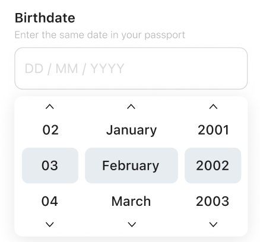

# UI Display and User Input Validation Using Livn API Data

## 0. Reference

Use the following link to refer data schemas and test apis

- [Livn API](https://dev.livnapi.com/public/)

Use the following link to have a general understanding about how the flow works.

- [Livn API v2.0 Developer Guide](https://dev.livnapi.com/public/Livn_API_v2.0_Developer_Guide.pdf)

- [brief introduction of Checkout flow](https://drive.google.com/file/d/1IbJ6DqkAS_Udhj-SWcWjfTgwEVc30dea/view?usp=sharinghttps://drive.google.com/file/d/1IbJ6DqkAS_Udhj-SWcWjfTgwEVc30dea/view?usp=sharing)

**Note.**

All code in the following are pseudo code to explain the logic. They can **NOT** be used directly in the development.

## 1. Display Questions

### 1.1 Description for question groups

use `questionGroup[i].caption` to describle question groups.

e.g. the following group of questions shoud be described by the `questionGroup[i].caption`


### 1.2 Description for questions and selectionOptions

For single question and selectionOption, use the following properties to describe it.

- `question.title`  or `selectionOption.title`as  title

- `question.description` or `selectionOption.description` as description, if present.

- `question.feeDescription` or  `selectionOption.feeDescription` if present, must be displayed to user.

e.g. descriotion for question


e.g. descriotion for selectionOption


### 1.3 Question type

The value of the `answerType` property indicates what kind of data type is expected for the answer to the current question. So it also defines what kind of input control for the answer.

To be specific:

A question with `answerType` of the following 

- `INTEGER,DECIMAL,TEXT,EMAIL or PHONE`, can be displayed with a input box
  
  

- `BINARY`,  can be displayed with a file selector

- `BOOLEAN`,  can be displayed with radioboxes or buttons with yes/no or true/false value.
  
  

- `DATE, TIME`,  can be displayed with a date/time picker
  
  

- `SELECT_SINGLE, SELECT_MULTIPLE`  can be displayed as dropdown list boxes
  
  

- `question.answerType == 'TEXT' && question.multiLine == true` can be displayed as multiple line text input box

### 1.4 Placeholder for the answer

To give an example of the answer to the user, we can set a placeholder at the answer control. The vaule of property `example` or `defaultValue`（if present） can be used to do this.

### 1.5 Mandatory question

To tell the user that whether the current question is mandatory or not, we can use the value of property `required`

```java
if(question.required == true){
     // add a mark to the question title , for example *
 }
```

### 1.6 Follow Up Questions

There are questions that their presence are depend on the answer of other questions.


The question above in the red box will only be displayed when the other question is answered as Yes.

This type of questions are only followed up by a question with ***answerType*** of ***SELECT_SINGLE*** or ***SELECT_MULTIPLE***, if one option with property of ***followUpQuestions*** is selected, this will trigger the display of the other question. Otherwise the followUpQuestions will not be displayed.

```java
if(selectionOption[i].selected == true 
    && selectionOption[i].followUpQuestions != null){
    //display the follow up questions 
}
```

## 2. Validate the user's answers to question

### 2.1 Presence validation

The property `question.required` indicate that a valid answer to this question is required to proceed with the checkout.

Absence of any answer to question marked by `required` will lead to failure of the flow.

```java
if(question.required == true 
    && questionControl.value.trim().length == 0 ){
    //prompt user to answer this question.
}
```

### 2.2 Format validation

The property `answerType` give a general format restrictions to the answers.

For `answerType` with the following value it is very intuitive to carry out the validation

- `BOOLEAN`

- `INTEGER`

- `DECIMAL`

e.g.

```java
if(question.answerType == "INTEGER"){
    try{
        answserInteger = Integer.parseInt(questionControl.value)
    }catch (NumberFormatException e) {
          //prompt user to answert this question with Integer.
    }

}
```

For other `answerType` with the following value, the answer format must match a corresponding fixed format.

- `DATE`  yyyy-MM-dd

- `TIME` HH:mm

- `EMAIL`

- `PHONE`
  A PSTN phone number (fixed line, mobile, fax etc). The string must include the country code prefixed with `+` and will be parsed and validated using [Google's libphonenumber library](https://github.com/google/libphonenumber). We recommend always using ITU E.164 or E.123 conform formatting, e.g. `+61292644411` or  +61 2 9264 4411

In this case, regular expression can be used to validate the value.

e.g.

```java
if(question.answerType == "EMAIL"){
    String regex = "^(.+)@(.+)$"; 
    Pattern pattern = Pattern.compile(regex);
    if(!pattern.matcher(questionControl.value).maches(){
    //prompt user to provide a valid email address.
    }
}
```

- For `answerType` == ”BINARY”
  Mainly used for image/document uploading. Answer has to come in the form of a Base64 encoded binary

- For `answerType== ”TEXT”`
  If the properties  `regex, lengthMin, lengthMax` are specified, the format of this text value must be valided by these conditions.
  
  ```java
  if(question.answerType == "TEXT"){
      if(question.lengthMin != null 
          && questionControl.value.length() < lengthMin)
      //prompt user to provide answer longer than lengthMin
  
  }
  ```

### 2.3 Value validation

 A few properties from the question can be used as value validation

- `valueMin`

- `valueMax`

these two properties  specify the minimum and maximum permitted value when the answerType is `INTEGER, DECIMAL or DATE`

- `selectMin`

- `selectMax`

Only for `answerType=SELECT_MULTIPLE`, the minimum and maximum number of values from the provided selectOptions that can be selected.

## 3. Display FareDetails and AddOns.

### 3.1 Three level of fares and four level of addOns.

#### 3.1.1 The three level of fares

In the Livn data structure, there are three levels of differentiation to define a bookable product. Besides, for each level and the top level of product, there could be optional addons attached to them

Base Variant → Time Slot → Fare

- **Base Variant** 
  Base variants are the first level of differentiation of top-level Products into the ultimately bookable product variants. 
  e.g. 
  `“Bus” vs “Bus & Boat” options of a city sightseeing pass.`

- **Time Slot** 
  The second level of differentiation of top-level Products into the ultimately bookable product variants 
  Within the requested booking date, TimeSlots identify the different bookable departures or activity session start times and/or durations, within their
  parent ProductVariant, including a generic TimeSlot for open-timed products which do not make that distinction.
  e.g.
  ` “7:00 - 10:00”, “9:00 -12:00”`

- **Fare**
  
  The third and lowest level of differentiation of top-level Products into the ultimately bookable product variants.
  Each Fare identifies a bookable pax or ticket type within a specific TimeSlot and thus BaseVariant of the top-level Product. While customers begin the checkout process by selecting a Product and departure or attendance date they wish to make a booking for, it is a selection of these Fares, in some cases combined with optional AddOns, that ultimately forms the concrete basis of the Booking.
  e.g. 
  `“Adult”, “Family”,"Child"`

#### 3.1.2  The four level of addOns

For addons, they can be organised in the following four levels

- **Fare level addons** Optional add-on products that can be booked in conjunction with this `Fare`.
  e.g.   
  `"champagne breakfast" for fare "Adult", 
  "nutritious breakfast" for fare "Child"`

- **Time slot level addons** Optional add-on products, that can be booked in conjunction with any `Fare` under this `TimeSlot`.
  
  e.g. 
  `"Photo package",
   "Photo + Video package"`

- **Base Variant level addons** Optional add-on products, that can be booked in conjunction with any `Fare` across this entire `BaseVariant` and all of its `TimeSlots`.
  
  e.g. 
  `"Exclusive package, Make it a private, more memorable experience with your loved ones"`

- **Product level addons**
  
  Optional add-on products, that can be booked in conjunction with any `Fare` across all `BaseVariant` and `TimeSlots`.
  
  e.g. 
  `"See you again package, Privilege to re-purchase this product at half price."`

### 3.2 Display FareDetails

#### 3.2.1 Availability of the three level fareDetails.

The UI will only display available baseVariant, timeslot, fare. For each level, availability should be checked.

- BaseVariant

```java

for (BaseVariant baseVariant:baseVariantList) { 
    if(baseVariant.available){
     //display this baseVariant
    }
}


```


- TimeSlot

```java
for(TimeSlot timeslot:timeSlotList){
    if(timeslot.available){
      //display this timeSlot
    }
}
```

- Fare

```java
for(Fare fare:fareList){
    if(fare.unitsAvailable > 0){
      //display this fare
     }
 }
```

#### 3.2.2 Description

For baseVariant, the following 3 properties should be used for description.

- `baseVariant.name`

- `baseVariant.description`

- `baseVariant.specialNotes`


For timeslot, the following properties should be used for description.

- `timeslot.name`

- `timeslot.description`

- `timeslot.duration`

- `timeslot.durationStr`

- `timeslot.durationMax`

- `timeslot.timeStart`

- `timeslot.timeEnd`

- `timeslot.specialNotes`

For fare, the following properties should be used for description.

- `fare.name`

- `fare.description`

- `fare.ageMin`

- `fare.ageMax`

- `fare.unitsAvailable`

- `fare.price`

- `fare.sepcialNotes`

- `fare.otherCharge`

All the above properties should be displayed to user if present.
